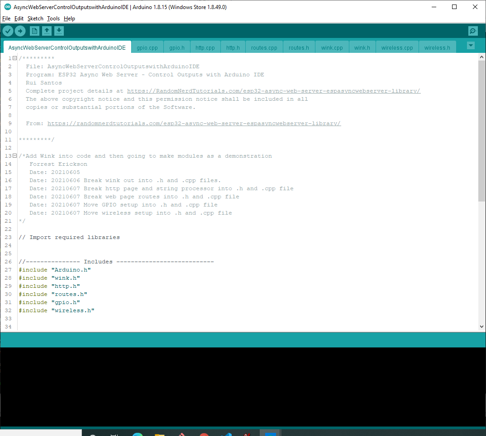

# Modularizing: AsyncWebServerControlOutputswithArduinoIDE
## RNT's, AsyncWebServerControlOutputswithArduinoIDE, implemented in multiple tabs.

I began this starting with the project at: https://randomnerdtutorials.com/esp32-async-web-server-espasyncwebserver-library/
After initial commit, I then added my "Wink" code to the setup() and loop() and verified function.
I then began to make tabs in the Arduino IDE for .h and .cpp files for the functionality I was pulling out of the main sketch.

Here is the GIT LOG showing in inverse cronology the steps I made to moduularize the code.

      Admin@Melies MINGW64 ~/Documents/PlatformIO/Projects/RNT/ArduinoIDE/AsyncWebServerControlOutputswithArduinoIDE (main)
      $ git log
      commit 06e685fb3848d273d5934337b5c6001806e2084f (HEAD -> main, origin/main)
      Author: Forrest Erickson <forresterickson@comcast.net>
      Date:   Mon Jun 7 18:30:33 2021 -0400

        Move wireless setup into .h and .cpp file.

      commit 693bd76bbad1618789db7eba22d3861ef18016f4
      Author: Forrest Erickson <forresterickson@comcast.net>
      Date:   Mon Jun 7 17:36:08 2021 -0400

         Move GPIO setup into .h and .cpp files.

      commit 43c61b785103fe2082dcfec742d0a0d7cf61fcda
      Author: Forrest Erickson <forresterickson@comcast.net>
      Date:   Mon Jun 7 17:23:08 2021 -0400

         Break web page routes into .h and .cpp file

      commit ee4a222504fafa853d65eccabc5d61269d90f13f
      Author: Forrest Erickson <forresterickson@comcast.net>
      Date:   Mon Jun 7 16:47:06 2021 -0400

        Move the web string proccessing from main to http.cpp. Move routing variables near functions.

      commit 72e3583ebeb5279ba12e6e111a5b61ace34ae498
      Author: Forrest Erickson <forresterickson@comcast.net>
      Date:   Mon Jun 7 16:24:45 2021 -0400

        Move the static web page into file.

      commit 844a44ded9fc81f534e593097cb7a6d7bad53ec6
      Author: Forrest Erickson <forresterickson@comcast.net>
      Date:   Sun Jun 6 05:49:54 2021 -0400

        Break wink out into .h and .cpp files. This works.

      commit ed073617703098b29063b71254c0c180ed0e3705
      Author: Forrest Erickson <forresterickson@comcast.net>
      Date:   Sun Jun 6 05:25:33 2021 -0400

        Add WINK to make LED_BUILTIN wink. This works.

      commit 1a5f6b46c99b23f7b951dd59eadf1cd9e3bc7022
      Author: Forrest Erickson <forresterickson@comcast.net>
      Date:   Thu Jun 3 16:31:16 2021 -0400

        Initial commit.

      Admin@Melies MINGW64 ~/Documents/PlatformIO/Projects/RNT/ArduinoIDE/AsyncWebServerControlOutputswithArduinoIDE (main)
